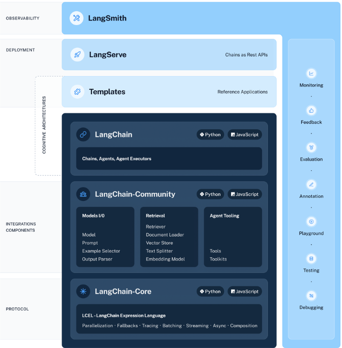

# Langchain

### Why Langchain ?

Langchain is open source framework to develop Gen AI app. It provides number of benefits that helps to create Gen AI apps. Like Pipeline, Debugging, Deployment etc. which comes in Langchain ecosystem.

### Langchain ecosystem ?

- LLMOps (Debugging, Monitoring, Evaluation) -> LangSmith
- LangServe -> Deployment (Rest api chain) (AWS, Huggingface space)

> https://www.linkedin.com/pulse/langchain-ecosystem-overview-baladhandapani-nagarajan-jenkc

## Important Components of Langchain

- **RAG** - Retrieval Augmented Generator

               1. Data Source or Data Ingestion  
                   2. Data Transformation (Spilt data to chunks)
                      3. Embedding (Text to vectors) 
                          4. Store (Chroma DB, AstraDB)

    - **Query**

                 1. Question
                      (Retrivel chain)
                    2. Prompt
                       3. LLM
                         4. Answer

**(Retrieval chain)** - Is vector db query find the result and give context to LLM

### Data Ingestion

- Could be done in any form like documents, weburl(beautiful soup), wikipedia database integration and many more
  provided by langchain framework.

https://python.langchain.com/v0.2/api_reference/community/document_loaders/langchain_community.document_loaders.csv_loader.CSVLoader.html#csvloader

### Data Transformation

- Data splitting into chunks because each model has some drawbacks regarding the space and it is better to send data in
  chunks for better performance.
- It is better to convert the input to the Document format it gives better features.

https://python.langchain.com/v0.2/api_reference/text_splitters/index.html

- We have multiple types of splitter available refer to the langchain document like RecursiveTextSplitter,
  CharacterSplitter, HTMLSplitter

### Data Embeddings

- Converting chunks into vectors
  * Open AI (Paid)
  * OLLama (OpenSource)
  * Huggingface (OpenSource)

### Vector Store
- FAISS (Facebook AI Similarity Search)
- ChromDB
- AstraDB
- Pinecone

## Retrieval Chain

# Prompt Template
Prompt template help to turn raw user information into a format that the LLM can work with.

